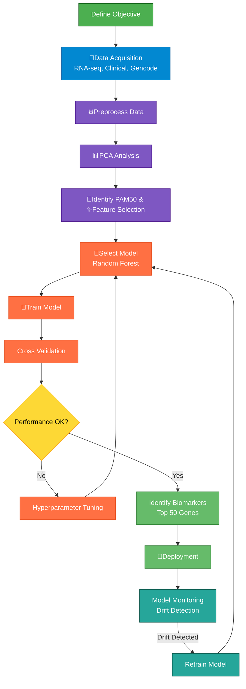

```mermaid   
flowchart TD

    %% --- Define Colors ---
    classDef start fill:#4CAF50,stroke:#1B5E20,color:#fff;
    classDef data fill:#0288D1,stroke:#01579B,color:#fff;
    classDef process fill:#7E57C2,stroke:#4A148C,color:#fff;
    classDef model fill:#FF7043,stroke:#E64A19,color:#fff;
    classDef decision fill:#FDD835,stroke:#F9A825,color:#000;
    classDef output fill:#66BB6A,stroke:#2E7D32,color:#fff;
    classDef monitor fill:#26A69A,stroke:#004D40,color:#fff;

    A[Define Objective]:::start
    B[🔄Data Acquisition<br/>RNA-seq, Clinical, Gencode]:::data
    C[⚙️Preprocess Data]:::process
    D[📊PCA Analysis]:::process
    E[🧬Identify PAM50 & ✨Feature Selection]:::process
    F[📝Select Model<br/>Random Forest]:::model
    G[🤖Train Model]:::model
    H[Cross Validation]:::model
    I{Performance OK?}:::decision
    J[Hyperparameter Tuning]:::model
    K[Identify Biomarkers<br/>Top 50 Genes]:::output
    L[🚀Deployment]:::output
    M[Model Monitoring<br/>Drift Detection]:::monitor
    N[Retrain Model]:::monitor
    A --> B --> C --> D --> E --> F --> G --> H --> I
    I -- No --> J --> F
    I -- Yes --> K --> L --> M
    M -- Drift Detected --> N --> F
```
