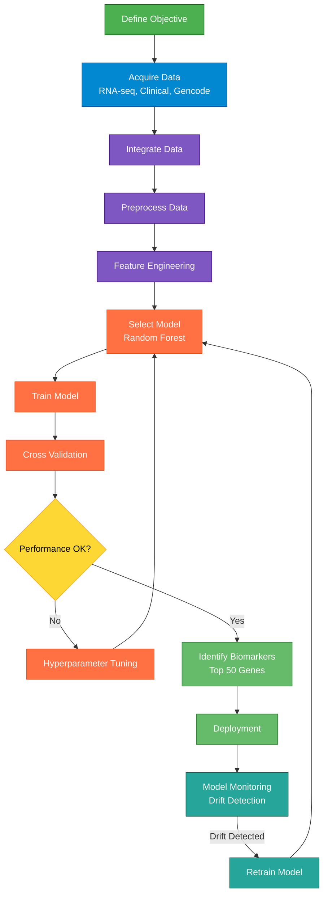
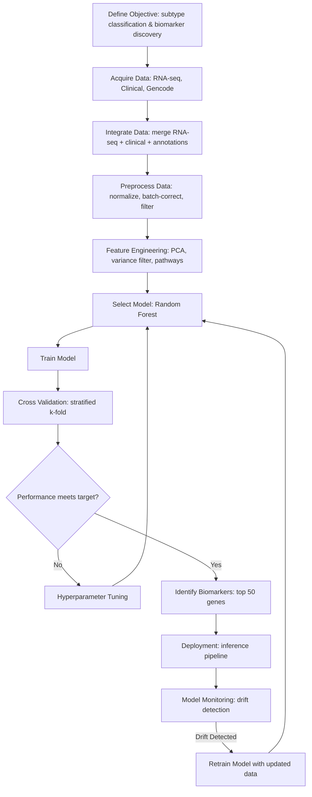

```mermaid
flowchart TD

    %% Top row forced horizontal   
    subgraph TOP[ ]   
    direction LR 
        A[Problem Statement] --> B[Data Acquisition] --> C[Data Preprocessing]     
    end     
   
    %% Vertical Flow
    C --> D[Choose Model]    
    D --> E[Training Model]
    E --> F[Cross Validation]
    F --> G{Training Goal Met?}
    G -- No --> H[Parameters Tuning]
    H --> E
    G -- Yes --> I[Deployment]
```






