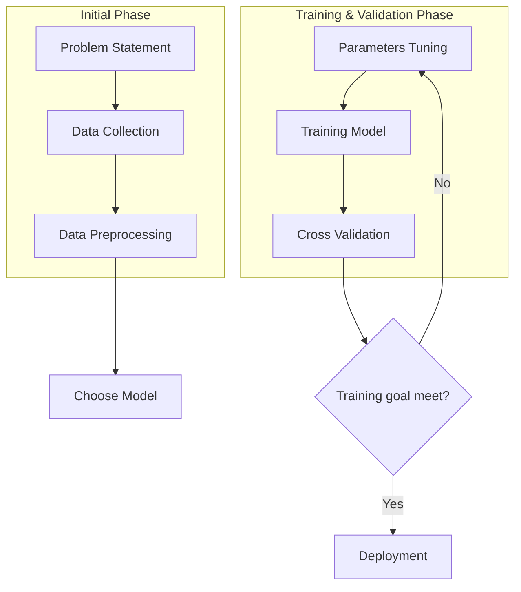
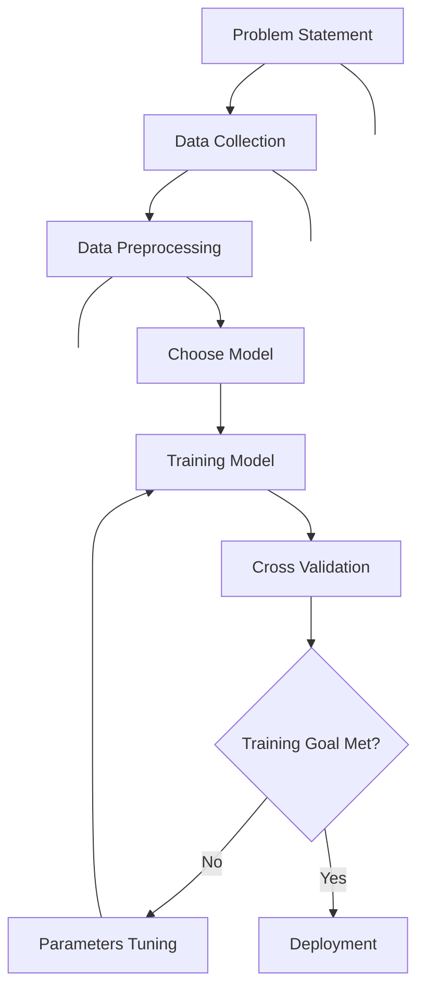
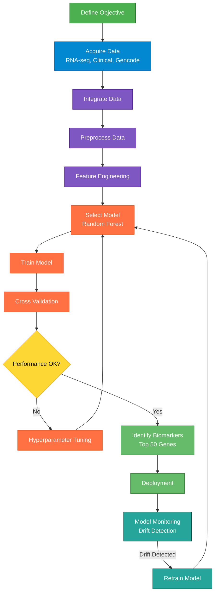
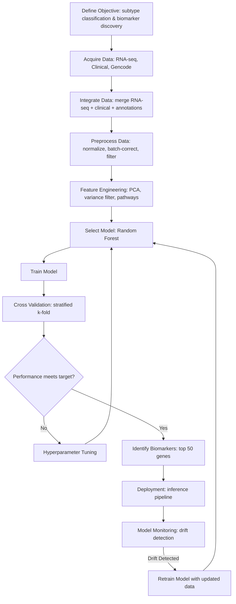

# Machine Learning Workflow

graph TD
    subgraph A [Initial Phase]
        direction LR
        A1[Problem Statement] --> A2[Data Collection] --> A3[Data Preprocessing]
    end
    
    A3 --> B[Choose Model]
    
    subgraph C [Training & Validation Phase]
        direction LR
        C1[Parameters Tuning] --> C2[Training Model] --> C3[Cross Validation]
    end
    
    C3 --> D{Training goal meet?}
    D -->|No| C1
    D -->|Yes| E[Deployment]

