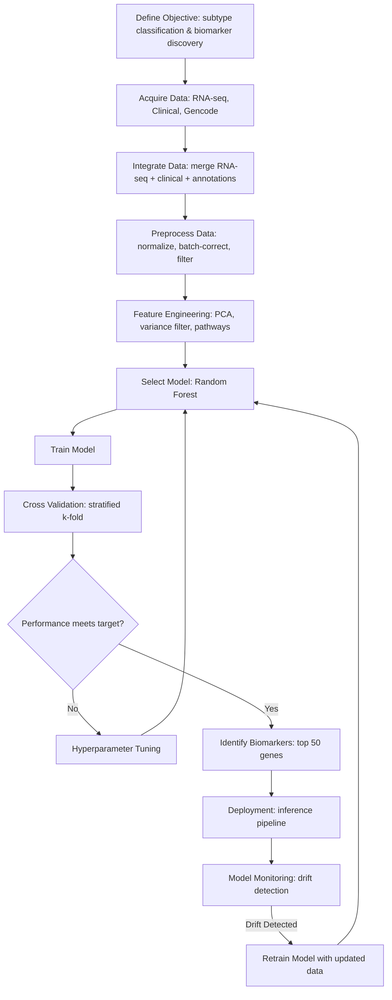

```mermaid   
flowchart TD   
    A[Define Objective: subtype classification & biomarker discovery]   
        --> B[Acquire Data: RNA-seq, Clinical, Gencode]   

    B --> C[Integrate Data: merge RNA-seq + clinical + annotations]   

    C --> D[Preprocess Data: normalize, batch-correct, filter]   

    D --> E[Feature Engineering: PCA, variance filter, pathways]   

    E --> F[Select Model: Random Forest]   

    F --> G[Train Model]   

    G --> H[Cross Validation: stratified k-fold]   

    H --> I{Performance meets target?}  

    I -- No --> J[Hyperparameter Tuning]  
    J --> F  

    I -- Yes --> K[Identify Biomarkers: top 50 genes]  

    K --> L[Deployment: inference pipeline]  

    L --> M[Model Monitoring: drift detection]   

    M -- Drift Detected --> N[Retrain Model with updated data]  
    N --> F  
```
