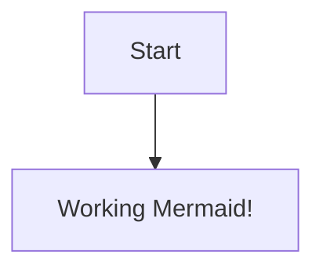
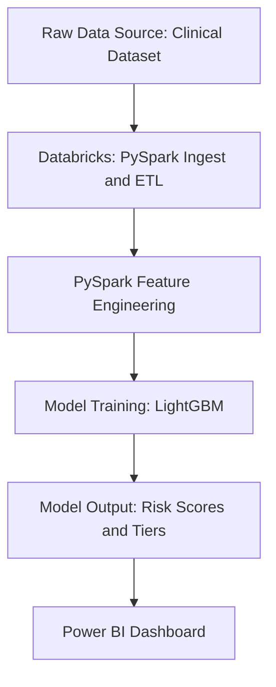

```mermaid
flowchart TD
    A[Raw RNA-seq Counts TCGA-BRCA Dataset] --> B[Clinical Metadata]
    B[Filtering, Normalization, Scaling]
    C[PAM50 Gene Selection]
    D[PCA (Variance Explained: 55.7%)]
    E[Random Forest Classifier, Hyperparameter Tuning]
    F[Model Evaluation: Accuracy / F1 / AUC]
    G[Feature Importance Ranking]
    H[Top 50 Biomarkers]
    G[Subtype Predictions: LumA / LumB / HER2 / Basal / Normal]
    F[Plots & Visualizations: PCA / Confusion Matrix / Feature Importances]
     A --> B --> C --> D --> E --> F
```


