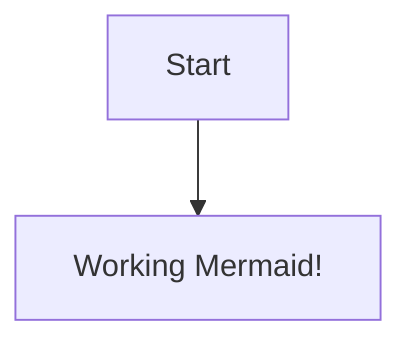

flowchart TD
    A[Raw RNA-seq Counts TCGA-BRCA] --> B[Clinical Metadata]
    B --> C[Filtering, Normalization, Scaling]
    C --> D[PAM50 Gene Selection]
    D --> E[PCA Variance 55.7%]
    E --> F[Random Forest Classifier]
    F --> G[Model Evaluation: Accuracy F1 AUC]
    G --> H[Feature Importance Ranking]
    H --> I[Top 50 Biomarkers]
    G --> J[Subtype Predictions: LumA LumB HER2 Basal Normal]
    F --> K[Plots & Visualizations: PCA Confusion Matrix Feature Importance]

