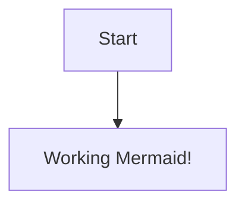

----------------------------------   

```mermaid        
flowchart TD                 
    A[🔄 Data Acquisition<br/> - RNA-seq data (TCGA-BRCA)<br/> - Clinical data (TCGA-BRCA)<br/> - PAM50 Gene List<br/> - GENCODE Annotation v.38] --> B[⚙️ Data Preprocessing & 🔍 Feature Engineering]                 
    B --> C[📊 PCA Analysis]                  
    C --> D[🧬 PAM50 Gene Selection & Annotation]            
    D --> E[✨ Feature Selection]                 
    E --> F[📝 Train & Test Split]           
    F --> G[🤖 Model Training & Evaluation<br/>(Random Forest Classification)]          
    G --> H[🔑 SHAP Analysis & Feature Importance Ranking]           
    H --> I[🏷️ Subtype Predictions & Biomarkers Identification]          
    G --> J[📈 Visualization Plots]          
    F --> K[🚀 Deployment Ready & 💼 Business Impact]              
```


